# VisionBrain CCTV Analytics Platform — Deep Technical Architecture

> Auto-generated architecture reference for the VisionBrain intelligent CCTV analytics platform.

---

## 1. System Overview

VisionBrain is an end-to-end intelligent CCTV analytics platform that transforms raw camera feeds into actionable security intelligence through a multi-layered AI pipeline.

### Key Metrics

| Metric | Value |
|---|---|
| Service Modules | 49 |
| API Endpoints | 98 |
| Lazy-Initialized Services | 56 |
| Backend LOC | 1,700+ (FastAPI / Python) |
| Dashboard Pages | 16 (Next.js) |
| Event Processor | Go micro-service |
| Knowledge Graph | Neo4j |
| Vector Database | Qdrant |
| Relational Store | SQLite |

### Processing Pipeline Summary

The platform operates as a three-stage pipeline:

1. **Edge** — Cameras capture frames; on-device models run detection, pose estimation, privacy filtering, and a lightweight Vision-Language Model (VLM). Structured events are emitted to a PubSub topic.
2. **Cloud Intelligence** — A Go event processor fans events into the FastAPI backend, which orchestrates 49 service modules covering perception, memory, reasoning, prediction, anomaly detection, action, investigation, analytics, compliance, and meta-learning.
3. **Operator Dashboard** — A Next.js frontend with 16 pages consumes real-time WebSocket alerts and REST APIs to present live feeds, KPIs, investigations, and compliance reports.

### Guiding Principles

- **Lazy initialization** — Every heavy service is instantiated on first use via `get_xxx()` accessors backed by a `_services` dict, keeping cold-start time minimal.
- **Stub fallback** — When an external model (e.g., Gemini) is unavailable, the client factory returns `"stub"` so the pipeline degrades gracefully.
- **Pipeline resilience** — Each processing stage is wrapped in `try/except pass`, ensuring a single module failure never crashes the event pipeline.
- **Dataclass-first modeling** — All domain objects are Python `@dataclass` instances for clarity and serialization.

---

## 2. Data Flow

### End-to-End Event Flow

```mermaid
graph TD
    Camera-->FrameExtractor
    FrameExtractor-->Detector
    Detector-->PoseEstimator
    PoseEstimator-->PrivacyEngine
    PrivacyEngine-->EdgeVLM
    EdgeVLM-->EventEmitter
    EventEmitter-->PubSub
    PubSub-->GoProcessor
    GoProcessor-->FastAPI

    subgraph FastAPI Processing Pipeline
        FastAPI-->KG_Ingest
        KG_Ingest-->Baseline
        Baseline-->Spatial
        Spatial-->Occupancy
        Occupancy-->Safety
        Safety-->LPR
        LPR-->CtxNormality
        CtxNormality-->SceneGraph
        SceneGraph-->Collective
        Collective-->EnvDetect
        EnvDetect-->Tailgate
        Tailgate-->DwellHeatmap
        DwellHeatmap-->Proactive
        Proactive-->AVFusion
        AVFusion-->Adversarial
        Adversarial-->Journey
        Journey-->Stress
        Stress-->Reasoning
        Reasoning-->Trackers
        Trackers-->WorldModel
        WorldModel-->ScenePredictor
        ScenePredictor-->AlertProcessing
    end

    subgraph Alert Dispatch
        AlertProcessing-->Dedup
        Dedup-->Persist
        Persist-->Webhook
        Webhook-->Explain
        Explain-->VisualGround
        VisualGround-->ActionEngine
        ActionEngine-->EventBus
        EventBus-->WSBroadcast
    end

    WSBroadcast-->Dashboard
    Dashboard-.->|WebSocket & REST|FastAPI
```



### Data Formats

| Hop | Format | Transport |
|---|---|---|
| Camera → FrameExtractor | RTSP H.264 | TCP stream |
| EdgeVLM → EventEmitter | JSON event envelope | In-process |
| EventEmitter → PubSub | Protobuf | gRPC / HTTP |
| PubSub → GoProcessor | Protobuf | gRPC pull |
| GoProcessor → FastAPI | JSON `POST /api/events` | HTTP |
| FastAPI → Dashboard | JSON over WebSocket | WS |

---

## 3. Architecture Layers

```mermaid
graph LR
    subgraph Edge
        capture[Capture]
        detection[Detection]
        pose[Pose Estimation]
        audio_edge[Audio Capture]
        privacy[Privacy Engine]
        edge_vlm[Edge VLM]
        emitter[Event Emitter]
    end

    subgraph Cloud Intelligence
        subgraph Perception
            visual_grounding[Visual Grounding]
            audio_visual[Audio-Visual Fusion]
            behavioral[Behavioral Analysis]
            environment_detector[Environment Detector]
        end
        subgraph Memory
            temporal_kg[Temporal KG]
            hypergraph_rag[Hypergraph RAG]
            entity_profiles[Entity Profiles]
            agent_memory[Agent Memory]
            spatial_mem[Spatial Memory]
        end
        subgraph Reasoning
            engine[Reasoning Engine]
            intent[Intent Recognition]
            causal[Causal Inference]
            explainer[Explainer]
            counterfactual[Counterfactual]
        end
        subgraph Prediction
            world_model[World Model]
            scene_predictor[Scene Predictor]
            contextual_normality[Contextual Normality]
            crowd[Crowd Analytics]
            scene_graph[Scene Graph]
        end
        subgraph Anomaly
            baseline[Baseline Detector]
            collective[Collective Anomaly]
            adversarial[Adversarial Detector]
        end
        subgraph Action
            action_engine[Action Engine]
            deterrence[Deterrence]
            proactive[Proactive Alerts]
            camera_programming[Camera Programming]
        end
        subgraph Investigation
            auto_investigator[Auto Investigator]
            forensic_search[Forensic Search]
            synopsis[Synopsis Generator]
            story_builder[Story Builder]
            query_engine[Query Engine]
        end
        subgraph Analytics
            kpi[KPI Engine]
            occupancy_svc[Occupancy]
            dwell[Dwell Analysis]
            heatmap[Heatmap Generator]
            retail[Retail Analytics]
            reports[Report Generator]
            digest[Digest Builder]
        end
        subgraph Compliance
            safety_monitor[Safety Monitor]
            consent[Consent Manager]
            lpr[LPR]
            tailgate[Tailgate Detector]
            access[Access Control]
        end
        subgraph Infrastructure
            persistence[Persistence]
            auth[Auth]
            cameras[Camera Manager]
            webhooks[Webhooks]
            event_bus[Event Bus]
            fleet[Fleet Manager]
            edge_manager[Edge Manager]
        end
        subgraph Meta
            self_evaluator[Self Evaluator]
            continual_learner[Continual Learner]
            dedup_svc[Dedup]
            federated[Federated Learning]
            federation[Federation]
        end
        subgraph Specialized
            evidence[Evidence Packager]
            shift[Shift Manager]
            resource_optimizer[Resource Optimizer]
            entity_journey[Entity Journey]
            simulation[Simulation]
            what_if[What-If Engine]
        end
    end

    subgraph API
        fastapi[FastAPI — 98 Endpoints]
        ws[WebSocket Server]
        auth_api[Auth Middleware]
    end

    subgraph Dashboard
        nextjs[Next.js — 16 Pages]
    end

    Edge-->|Events|API
    API-->|Orchestrates|Cloud Intelligence
    API-->|WS + REST|Dashboard
```

---

## 4. Service Module Reference

| Category | Module | Package Path | Key Classes | Dependencies | Description |
|---|---|---|---|---|---|
| **Perception** | visual_grounding | `services.visual_grounding` | `VisualGroundingService` | Gemini, Qdrant | Localizes natural-language references to bounding boxes in frames |
| **Perception** | audio_visual | `services.audio_visual` | `AudioVisualFusionService` | audio capture, detector | Fuses audio events with visual detections for richer context |
| **Perception** | behavioral | `services.behavioral` | `BehavioralAnalyzer` | pose, tracker | Classifies behaviors (loitering, running, fighting) from pose sequences |
| **Perception** | environment_detector | `services.environment_detector` | `EnvironmentDetector` | frame extractor | Detects environmental conditions — lighting, weather, smoke, fire |
| **Memory** | temporal_kg | `services.temporal_kg` | `TemporalKnowledgeGraph` | Neo4j driver | Maintains a time-aware knowledge graph of entities and relationships |
| **Memory** | hypergraph_rag | `services.hypergraph_rag` | `HypergraphRAG` | Qdrant, Gemini | Retrieval-augmented generation over a hypergraph of scene memory |
| **Memory** | entity_profiles | `services.entity_profiles` | `EntityProfileStore` | SQLite, KG | Builds and queries long-lived profiles for recurring entities |
| **Memory** | agent_memory | `services.agent_memory` | `AgentMemory` | SQLite | Episodic + semantic memory for the reasoning agent |
| **Memory** | spatial | `services.spatial` | `SpatialService` | zone config | Manages zones, floor plans, and spatial relationships |
| **Reasoning** | engine | `services.reasoning` | `ReasoningEngine` | Gemini, KG, memory | Multi-step chain-of-thought reasoning over scene context |
| **Reasoning** | intent | `services.intent` | `IntentRecognizer` | behavioral, KG | Infers actor intent from behavioral patterns and context |
| **Reasoning** | causal | `services.causal` | `CausalInference` | KG, reasoning | Builds causal graphs to explain why an event occurred |
| **Reasoning** | explainer | `services.explainer` | `Explainer` | reasoning, Gemini | Generates human-readable explanations for alerts |
| **Reasoning** | counterfactual | `services.counterfactual` | `CounterfactualEngine` | causal, world_model | Answers "what if X had not happened?" queries |
| **Prediction** | world_model | `services.world_model` | `WorldModel` | KG, scene_graph | Maintains a predictive world state and forecasts next states |
| **Prediction** | scene_predictor | `services.scene_predictor` | `ScenePredictor` | world_model, Gemini | Predicts future scene configurations for proactive alerting |
| **Prediction** | contextual_normality | `services.contextual_normality` | `ContextualNormality` | baseline, KG | Learns per-camera, per-time-slot normality baselines |
| **Prediction** | crowd | `services.crowd` | `CrowdAnalytics` | detector, occupancy | Estimates crowd density, flow, and stampede risk |
| **Prediction** | scene_graph | `services.scene_graph` | `SceneGraphBuilder` | detector, spatial | Builds a structured graph of objects and relations per frame |
| **Anomaly** | baseline | `services.baseline` | `BaselineDetector` | persistence | Statistical anomaly detection against rolling baselines |
| **Anomaly** | collective | `services.collective` | `CollectiveAnomalyDetector` | baseline, crowd | Detects anomalies that only manifest across multiple cameras |
| **Anomaly** | adversarial | `services.adversarial` | `AdversarialDetector` | detector, Gemini | Detects adversarial attacks — camera tampering, spoofing, occlusion |
| **Action** | action_engine | `services.action_engine` | `ActionEngine` | reasoning, webhooks | Decides and executes response actions (lock door, sound alarm) |
| **Action** | deterrence | `services.deterrence` | `DeterrenceService` | action_engine, cameras | Activates deterrence measures — lights, speakers, PTZ |
| **Action** | proactive | `services.proactive` | `ProactiveAlertService` | scene_predictor | Issues alerts before an incident fully materializes |
| **Action** | camera_programming | `services.camera_programming` | `CameraProgrammer` | cameras, spatial | Auto-adjusts PTZ presets and patrol routes based on activity |
| **Investigation** | auto_investigator | `services.auto_investigator` | `AutoInvestigator` | KG, forensic_search, Gemini | Autonomously investigates an alert by gathering evidence |
| **Investigation** | forensic_search | `services.forensic_search` | `ForensicSearch` | Qdrant, persistence | Searches historical events by natural language or attribute |
| **Investigation** | synopsis | `services.synopsis` | `SynopsisGenerator` | KG, Gemini | Generates a narrative synopsis of a time window |
| **Investigation** | story_builder | `services.story_builder` | `StoryBuilder` | KG, entity_profiles | Builds a chronological story for an entity or incident |
| **Investigation** | query_engine | `services.query_engine` | `QueryEngine` | Gemini, KG, Qdrant | Natural-language query interface over all platform data |
| **Analytics** | kpi | `services.kpi` | `KPIEngine` | persistence, occupancy | Computes security and operational KPIs |
| **Analytics** | occupancy | `services.occupancy` | `OccupancyTracker` | detector, spatial | Real-time per-zone occupancy counting |
| **Analytics** | dwell | `services.dwell` | `DwellAnalyzer` | tracker, spatial | Measures how long entities stay in zones |
| **Analytics** | heatmap | `services.heatmap` | `HeatmapGenerator` | tracker, spatial | Generates spatial and temporal heatmaps |
| **Analytics** | retail | `services.retail` | `RetailAnalytics` | occupancy, dwell, entity_journey | Retail-specific metrics — conversion, queue time, path analysis |
| **Analytics** | reports | `services.reports` | `ReportGenerator` | kpi, Gemini | Generates PDF/HTML periodic reports |
| **Analytics** | digest | `services.digest` | `DigestBuilder` | kpi, synopsis | Builds daily/weekly executive digests |
| **Compliance** | safety_monitor | `services.safety_monitor` | `SafetyMonitor` | detector, pose | Monitors PPE, hard-hat, vest compliance |
| **Compliance** | consent | `services.consent` | `ConsentManager` | persistence | Manages data-subject consent and GDPR/CCPA compliance |
| **Compliance** | lpr | `services.lpr` | `LPRService` | detector, OCR | License plate recognition and lookup |
| **Compliance** | tailgate | `services.tailgate` | `TailgateDetector` | detector, access | Detects unauthorized tailgating through access points |
| **Compliance** | access | `services.access` | `AccessControl` | auth, spatial | Zone-based access control enforcement |
| **Infrastructure** | persistence | `services.persistence` | `PersistenceService` | SQLite | CRUD for events, alerts, configs, and audit logs |
| **Infrastructure** | auth | `services.auth` | `AuthService` | JWT | Authentication and RBAC |
| **Infrastructure** | cameras | `services.cameras` | `CameraManager` | RTSP, ONVIF | Camera discovery, health, and stream management |
| **Infrastructure** | webhooks | `services.webhooks` | `WebhookManager` | persistence | Manages outbound webhook subscriptions and delivery |
| **Infrastructure** | event_bus | `services.event_bus` | `EventBus` | asyncio | In-process pub/sub for decoupled service communication |
| **Infrastructure** | fleet | `services.fleet` | `FleetManager` | cameras, edge_manager | Manages a fleet of edge devices |
| **Infrastructure** | edge_manager | `services.edge_manager` | `EdgeManager` | gRPC | Deploys models and configs to edge nodes |
| **Meta** | self_evaluator | `services.self_evaluator` | `SelfEvaluator` | persistence, kpi | Evaluates platform accuracy and flags drift |
| **Meta** | continual_learner | `services.continual_learner` | `ContinualLearner` | self_evaluator | Triggers retraining when performance degrades |
| **Meta** | dedup | `services.dedup` | `DedupService` | persistence | Deduplicates semantically similar alerts |
| **Meta** | federated | `services.federated` | `FederatedLearning` | fleet | Coordinates federated model training across edge nodes |
| **Meta** | federation | `services.federation` | `FederationService` | auth, event_bus | Multi-site federation for distributed deployments |
| **Specialized** | evidence | `services.evidence` | `EvidencePackager` | persistence, forensic_search | Packages evidence bundles for export or legal hold |
| **Specialized** | shift | `services.shift` | `ShiftManager` | persistence, auth | Manages operator shifts, handoffs, and task assignment |
| **Specialized** | resource_optimizer | `services.resource_optimizer` | `ResourceOptimizer` | fleet, kpi | Optimizes compute/bandwidth allocation across edge + cloud |
| **Specialized** | entity_journey | `services.entity_journey` | `EntityJourneyTracker` | KG, tracker, spatial | Tracks an entity's full journey across cameras and zones |
| **Specialized** | simulation | `services.simulation` | `SimulationEngine` | world_model | Runs what-if simulations on historical or synthetic data |
| **Specialized** | what_if | `services.what_if` | `WhatIfEngine` | simulation, counterfactual | Interactive what-if scenario builder for operators |

---

## 5. Event Pipeline Deep Dive — `POST /api/events`

Each incoming event passes through 22 sequential processing stages. Every stage is wrapped in `try/except pass` so a single failure never halts the pipeline.

| Step | Service Called | What It Does | Produces | Failure Handling |
|---|---|---|---|---|
| 1 | `PersistenceService.save_event()` | Persists raw event to SQLite | `event_id` | Log + abort (only hard failure) |
| 2 | `TemporalKnowledgeGraph.ingest()` | Creates/updates nodes and edges in Neo4j | KG triples | `try/except pass` — event still processed |
| 3 | `BaselineDetector.evaluate()` | Compares event features against rolling statistical baselines | `anomaly_score: float` | Returns 0.0 on failure |
| 4 | `SpatialService.enrich()` | Attaches zone, floor, and region metadata | Enriched event dict | Pass-through on failure |
| 5 | `OccupancyTracker.update()` | Increments/decrements zone occupancy counters | `occupancy_snapshot` | Stale count retained |
| 6 | `SafetyMonitor.check()` | Evaluates PPE / hard-hat / vest compliance | `safety_violations[]` | Empty list on failure |
| 7 | `LPRService.process()` | Runs plate recognition if vehicle detected | `plate_text, plate_confidence` | `None` on failure |
| 8 | `ContextualNormality.score()` | Scores event against learned per-camera normality | `normality_score: float` | Returns 0.5 (neutral) |
| 9 | `SceneGraphBuilder.build()` | Constructs object-relation graph for the frame | `SceneGraph` dataclass | Empty graph on failure |
| 10 | `CollectiveAnomalyDetector.evaluate()` | Cross-camera collective anomaly check | `collective_score: float` | Returns 0.0 |
| 11 | `EnvironmentDetector.detect()` | Classifies environmental conditions | `env_conditions[]` | Empty list |
| 12 | `TailgateDetector.check()` | Detects tailgating at access points | `tailgate_alert?` | `None` |
| 13 | `DwellAnalyzer.update()` + `HeatmapGenerator.update()` | Updates dwell timers and heatmap accumulators | Side-effects on state | Pass-through |
| 14 | `ProactiveAlertService.evaluate()` | Checks if predictive thresholds are breached | `proactive_alerts[]` | Empty list |
| 15 | `AudioVisualFusionService.fuse()` | Merges audio context with visual detections | `fused_event` | Original event retained |
| 16 | `AdversarialDetector.check()` | Checks for camera tampering / spoofing | `adversarial_flag: bool` | `False` |
| 17 | `EntityJourneyTracker.update()` | Extends the entity's cross-camera journey | Journey edge in KG | Pass-through |
| 18 | `StressAnalyzer.evaluate()` | Estimates operator / crowd stress levels | `stress_score: float` | Returns 0.0 |
| 19 | `ReasoningEngine.reason()` | Multi-step chain-of-thought over accumulated context | `reasoning_result` with `alert_decision` | Stub returns no-alert |
| 20 | `TrackerService.update()` | Updates multi-object trackers per camera | `track_ids[]` | Stale tracks retained |
| 21 | `WorldModel.update()` | Updates predictive world state | `world_state` | Stale state retained |
| 22 | `ScenePredictor.predict()` | Forecasts next scene state | `predicted_scene` | `None` |

### Alert Dispatch (post-pipeline)

If `reasoning_result.alert_decision` is truthy:

| Sub-step | Service | Action |
|---|---|---|
| A | `DedupService.check()` | Deduplicates against recent alerts (cosine similarity on embeddings) |
| B | `PersistenceService.save_alert()` | Persists alert to SQLite |
| C | `WebhookManager.dispatch()` | Fires registered webhooks asynchronously |
| D | `Explainer.explain()` | Generates human-readable explanation via Gemini |
| E | `VisualGroundingService.ground()` | Produces annotated frame with bounding boxes |
| F | `ActionEngine.execute()` | Triggers configured response actions |
| G | `EventBus.publish("alert")` | Publishes to in-process event bus |
| H | `WebSocketBroadcast.send()` | Pushes alert + explanation + frame to all connected dashboards |

---

## 6. Technology Stack

| Component | Technology | Version | Purpose |
|---|---|---|---|
| Backend API | FastAPI | 0.111+ | Async REST + WebSocket server |
| Event Processor | Go | 1.22+ | High-throughput PubSub consumer, event fan-out |
| Dashboard | Next.js (React) | 14+ | Operator UI with 16 pages |
| Knowledge Graph | Neo4j | 5.x | Temporal entity-relationship storage |
| Vector Database | Qdrant | 1.8+ | Embedding similarity search for RAG and forensic search |
| Relational Store | SQLite | 3.40+ | Events, alerts, configs, audit logs |
| LLM / VLM | Google Gemini | 1.5 Pro | Reasoning, explanation, scene description |
| Edge VLM | Gemini Nano / ONNX | — | On-device vision-language inference |
| Object Detection | YOLOv8 / RT-DETR | — | Real-time object and person detection |
| Pose Estimation | MediaPipe / ViTPose | — | Skeleton extraction for behavioral analysis |
| OCR (LPR) | PaddleOCR | 2.7+ | License plate text extraction |
| Message Bus | Google Cloud Pub/Sub | — | Edge-to-cloud event transport |
| Auth | JWT + bcrypt | — | Token-based authentication and RBAC |
| WebSocket | FastAPI WebSocket | — | Real-time alert push to dashboard |
| Containerization | Docker | 24+ | Service packaging |
| Orchestration | Kubernetes | 1.29+ | Production deployment |
| CI/CD | GitHub Actions | — | Build, test, deploy pipelines |
| Monitoring | Prometheus + Grafana | — | Metrics and dashboards |
| Logging | Structlog | 23+ | Structured JSON logging |
| Task Queue | Celery + Redis | — | Async report generation, evidence packaging |

---

## 7. Key Design Patterns

### 7.1 Lazy Initialization via `_services` Dict

All heavy services are instantiated on first access, not at import time.

```python
_services: dict[str, Any] = {}

def get_reasoning_engine() -> ReasoningEngine:
    if "reasoning" not in _services:
        _services["reasoning"] = ReasoningEngine(
            kg=get_temporal_kg(),
            memory=get_agent_memory(),
            client=_get_client(),
        )
    return _services["reasoning"]
```

This keeps startup fast and allows selective initialization based on which endpoints are actually called.

### 7.2 Stub Fallback for External Models

```python
def _get_client():
    try:
        import google.generativeai as genai
        genai.configure(api_key=os.getenv("GEMINI_API_KEY"))
        return genai.GenerativeModel("gemini-1.5-pro")
    except Exception:
        return "stub"
```

Every service that uses the client checks `if client == "stub"` and returns a safe default, enabling the full pipeline to run in offline/test mode.

### 7.3 Constructor Dependency Injection

Services receive their dependencies via `__init__`, making them testable and composable.

```python
@dataclass
class ReasoningEngine:
    kg: TemporalKnowledgeGraph
    memory: AgentMemory
    client: Any  # Gemini model or "stub"

    def reason(self, event: Event) -> ReasoningResult:
        context = self.kg.get_context(event.entity_id)
        history = self.memory.recall(event.camera_id)
        if self.client == "stub":
            return ReasoningResult(alert_decision=False, explanation="stub")
        prompt = self._build_prompt(event, context, history)
        response = self.client.generate_content(prompt)
        return self._parse(response)
```

### 7.4 Dataclass-First Data Modeling

```python
@dataclass
class Event:
    event_id: str
    camera_id: str
    timestamp: datetime
    detections: list[Detection]
    pose_data: list[PoseSkeleton] | None = None
    audio_features: dict | None = None
    metadata: dict = field(default_factory=dict)

@dataclass
class Alert:
    alert_id: str
    event_id: str
    severity: str  # "low" | "medium" | "high" | "critical"
    category: str
    explanation: str
    grounded_frame: bytes | None = None
    actions_taken: list[str] = field(default_factory=list)
```

### 7.5 Try/Except Pass for Pipeline Resilience

```python
async def process_event(event: Event) -> ProcessingResult:
    result = ProcessingResult(event_id=event.event_id)

    try:
        result.anomaly_score = get_baseline_detector().evaluate(event)
    except Exception:
        pass  # anomaly_score stays 0.0

    try:
        result.safety_violations = get_safety_monitor().check(event)
    except Exception:
        pass  # empty list

    try:
        result.reasoning = get_reasoning_engine().reason(event)
    except Exception:
        pass  # no alert generated

    return result
```

### 7.6 WebSocket Broadcast for Real-Time Alerts

```python
connected_clients: set[WebSocket] = set()

async def ws_endpoint(websocket: WebSocket):
    await websocket.accept()
    connected_clients.add(websocket)
    try:
        while True:
            await websocket.receive_text()  # keep-alive
    except WebSocketDisconnect:
        connected_clients.discard(websocket)

async def broadcast_alert(alert: Alert):
    payload = asdict(alert)
    dead = set()
    for ws in connected_clients:
        try:
            await ws.send_json(payload)
        except Exception:
            dead.add(ws)
    connected_clients -= dead
```

---

## 8. API Endpoint Reference (98 Endpoints)

### Core Pipeline

| Method | Path | Description | Request | Response |
|---|---|---|---|---|
| POST | `/api/events` | Ingest a new event from edge/Go processor | `Event` JSON body | `{event_id, alerts[]}` |
| GET | `/api/events/{id}` | Retrieve a processed event | — | `Event` + enrichments |

### Query / Chat

| Method | Path | Description | Request | Response |
|---|---|---|---|---|
| POST | `/api/query` | Natural-language query over platform data | `{query: str}` | `{answer, sources[]}` |
| POST | `/api/chat` | Multi-turn chat with reasoning agent | `{message, session_id}` | `{reply, reasoning_trace}` |

### KPI

| Method | Path | Description | Request | Response |
|---|---|---|---|---|
| GET | `/api/kpi/summary` | Current KPI summary | `?window=1h` | `KPISummary` |
| GET | `/api/kpi/trends` | KPI trends over time | `?metric&from&to` | `TimeSeries[]` |

### Rules

| Method | Path | Description | Request | Response |
|---|---|---|---|---|
| GET | `/api/rules` | List all alert rules | — | `Rule[]` |
| POST | `/api/rules` | Create a new rule | `Rule` body | `{rule_id}` |
| PUT | `/api/rules/{id}` | Update a rule | `Rule` body | `Rule` |
| DELETE | `/api/rules/{id}` | Delete a rule | — | `204` |

### Spatial

| Method | Path | Description | Request | Response |
|---|---|---|---|---|
| GET | `/api/spatial/zones` | List all zones | — | `Zone[]` |
| POST | `/api/spatial/zones` | Create a zone | `Zone` body | `{zone_id}` |
| GET | `/api/spatial/zones/{id}/occupancy` | Zone occupancy snapshot | — | `OccupancySnapshot` |

### Alerts

| Method | Path | Description | Request | Response |
|---|---|---|---|---|
| GET | `/api/alerts` | List alerts with filters | `?severity&camera&from&to` | `Alert[]` |
| GET | `/api/alerts/{id}` | Get alert detail | — | `Alert` + explanation |
| PUT | `/api/alerts/{id}/acknowledge` | Acknowledge an alert | `{operator_id}` | `Alert` |
| PUT | `/api/alerts/{id}/resolve` | Resolve an alert | `{resolution_note}` | `Alert` |

### Trackers

| Method | Path | Description | Request | Response |
|---|---|---|---|---|
| GET | `/api/trackers` | List active trackers | `?camera_id` | `Tracker[]` |
| GET | `/api/trackers/{id}/trail` | Get entity trail | `?from&to` | `TrailPoint[]` |

### Story / Profile

| Method | Path | Description | Request | Response |
|---|---|---|---|---|
| GET | `/api/stories/{entity_id}` | Get entity story | `?from&to` | `Story` |
| GET | `/api/profiles/{entity_id}` | Get entity profile | — | `EntityProfile` |
| POST | `/api/profiles/{entity_id}/tag` | Tag an entity | `{tag}` | `EntityProfile` |

### Investigation

| Method | Path | Description | Request | Response |
|---|---|---|---|---|
| POST | `/api/investigate` | Launch auto-investigation | `{alert_id}` | `{investigation_id}` |
| GET | `/api/investigate/{id}` | Get investigation status/results | — | `Investigation` |
| GET | `/api/investigate/{id}/timeline` | Investigation timeline | — | `TimelineEntry[]` |

### Synopsis

| Method | Path | Description | Request | Response |
|---|---|---|---|---|
| POST | `/api/synopsis` | Generate synopsis for time window | `{camera_id, from, to}` | `{synopsis_id}` |
| GET | `/api/synopsis/{id}` | Get generated synopsis | — | `Synopsis` |

### Floor Plan

| Method | Path | Description | Request | Response |
|---|---|---|---|---|
| GET | `/api/floorplan` | List floor plans | — | `FloorPlan[]` |
| POST | `/api/floorplan` | Upload a floor plan | Multipart image + metadata | `{floorplan_id}` |
| PUT | `/api/floorplan/{id}/cameras` | Map cameras to floor plan | `{camera_positions[]}` | `FloorPlan` |

### Search

| Method | Path | Description | Request | Response |
|---|---|---|---|---|
| POST | `/api/search` | Forensic search by NL or attributes | `{query, filters}` | `SearchResult[]` |
| POST | `/api/search/similar` | Find similar events by embedding | `{event_id, top_k}` | `SearchResult[]` |

### Cameras

| Method | Path | Description | Request | Response |
|---|---|---|---|---|
| GET | `/api/cameras` | List cameras | — | `Camera[]` |
| POST | `/api/cameras` | Register a camera | `Camera` body | `{camera_id}` |
| GET | `/api/cameras/{id}/health` | Camera health status | — | `CameraHealth` |
| POST | `/api/cameras/{id}/snapshot` | Request a snapshot | — | `{image_url}` |
| PUT | `/api/cameras/{id}/config` | Update camera config | Config body | `Camera` |

### Webhooks

| Method | Path | Description | Request | Response |
|---|---|---|---|---|
| GET | `/api/webhooks` | List webhook subscriptions | — | `Webhook[]` |
| POST | `/api/webhooks` | Create webhook subscription | `Webhook` body | `{webhook_id}` |
| DELETE | `/api/webhooks/{id}` | Delete webhook | — | `204` |
| POST | `/api/webhooks/{id}/test` | Test-fire a webhook | — | `{status_code}` |

### Zones

| Method | Path | Description | Request | Response |
|---|---|---|---|---|
| GET | `/api/zones` | List all zones | — | `Zone[]` |
| POST | `/api/zones` | Create zone | `Zone` body | `{zone_id}` |
| PUT | `/api/zones/{id}` | Update zone | `Zone` body | `Zone` |
| DELETE | `/api/zones/{id}` | Delete zone | — | `204` |

### Occupancy

| Method | Path | Description | Request | Response |
|---|---|---|---|---|
| GET | `/api/occupancy` | Global occupancy snapshot | — | `OccupancyMap` |
| GET | `/api/occupancy/{zone_id}/history` | Zone occupancy history | `?from&to&interval` | `TimeSeries` |

### Compliance

| Method | Path | Description | Request | Response |
|---|---|---|---|---|
| GET | `/api/compliance/safety` | Safety compliance summary | `?from&to` | `SafetyReport` |
| GET | `/api/compliance/violations` | List compliance violations | `?type&from&to` | `Violation[]` |

### LPR

| Method | Path | Description | Request | Response |
|---|---|---|---|---|
| GET | `/api/lpr/plates` | List recognized plates | `?from&to` | `PlateRecord[]` |
| GET | `/api/lpr/search` | Search by plate text | `?plate` | `PlateRecord[]` |
| POST | `/api/lpr/watchlist` | Add plate to watchlist | `{plate, reason}` | `{watchlist_id}` |
| DELETE | `/api/lpr/watchlist/{id}` | Remove from watchlist | — | `204` |

### Reports

| Method | Path | Description | Request | Response |
|---|---|---|---|---|
| POST | `/api/reports/generate` | Generate a report | `{type, from, to, format}` | `{report_id}` |
| GET | `/api/reports/{id}` | Download report | — | PDF/HTML binary |
| GET | `/api/reports` | List generated reports | — | `ReportMeta[]` |

### Digest

| Method | Path | Description | Request | Response |
|---|---|---|---|---|
| GET | `/api/digest/latest` | Get latest digest | — | `Digest` |
| POST | `/api/digest/generate` | Force-generate a digest | `{period}` | `{digest_id}` |

### Auth

| Method | Path | Description | Request | Response |
|---|---|---|---|---|
| POST | `/api/auth/login` | Authenticate | `{username, password}` | `{token, refresh_token}` |
| POST | `/api/auth/refresh` | Refresh token | `{refresh_token}` | `{token}` |
| GET | `/api/auth/me` | Current user info | — | `User` |
| POST | `/api/auth/users` | Create user (admin) | `User` body | `{user_id}` |

### Crowd

| Method | Path | Description | Request | Response |
|---|---|---|---|---|
| GET | `/api/crowd/density` | Current crowd density map | `?zone_id` | `DensityMap` |
| GET | `/api/crowd/flow` | Crowd flow vectors | `?zone_id` | `FlowVector[]` |

### Scene Graph

| Method | Path | Description | Request | Response |
|---|---|---|---|---|
| GET | `/api/scene-graph/{camera_id}/latest` | Latest scene graph | — | `SceneGraph` |
| GET | `/api/scene-graph/{camera_id}/history` | Scene graph history | `?from&to` | `SceneGraph[]` |

### Normality

| Method | Path | Description | Request | Response |
|---|---|---|---|---|
| GET | `/api/normality/{camera_id}` | Normality profile for camera | — | `NormalityProfile` |
| PUT | `/api/normality/{camera_id}/reset` | Reset normality baseline | — | `204` |

### Counterfactual

| Method | Path | Description | Request | Response |
|---|---|---|---|---|
| POST | `/api/counterfactual` | Run counterfactual query | `{event_id, what_if}` | `CounterfactualResult` |

### Collective

| Method | Path | Description | Request | Response |
|---|---|---|---|---|
| GET | `/api/collective/anomalies` | List collective anomalies | `?from&to` | `CollectiveAnomaly[]` |

### Simulate

| Method | Path | Description | Request | Response |
|---|---|---|---|---|
| POST | `/api/simulate` | Run a simulation | `{scenario, params}` | `{simulation_id}` |
| GET | `/api/simulate/{id}` | Get simulation results | — | `SimulationResult` |

### System Health

| Method | Path | Description | Request | Response |
|---|---|---|---|---|
| GET | `/api/health` | System health check | — | `{status, services{}}` |
| GET | `/api/health/services` | Per-service health | — | `ServiceHealth[]` |

### Dwell

| Method | Path | Description | Request | Response |
|---|---|---|---|---|
| GET | `/api/dwell/{zone_id}` | Dwell stats for zone | `?from&to` | `DwellStats` |
| GET | `/api/dwell/alerts` | Dwell-time alerts | — | `DwellAlert[]` |

### Heatmap

| Method | Path | Description | Request | Response |
|---|---|---|---|---|
| GET | `/api/heatmap/{camera_id}` | Spatial heatmap | `?from&to` | PNG image |
| GET | `/api/heatmap/{zone_id}/temporal` | Temporal heatmap | `?from&to` | `TemporalHeatmap` |

### Fleet

| Method | Path | Description | Request | Response |
|---|---|---|---|---|
| GET | `/api/fleet/devices` | List edge devices | — | `EdgeDevice[]` |
| POST | `/api/fleet/deploy` | Deploy model to device(s) | `{model_id, device_ids[]}` | `DeploymentStatus` |
| GET | `/api/fleet/devices/{id}/status` | Device status | — | `DeviceStatus` |

### Proactive

| Method | Path | Description | Request | Response |
|---|---|---|---|---|
| GET | `/api/proactive/predictions` | Current proactive predictions | — | `Prediction[]` |
| PUT | `/api/proactive/config` | Update proactive thresholds | Config body | `ProactiveConfig` |

### Consent

| Method | Path | Description | Request | Response |
|---|---|---|---|---|
| GET | `/api/consent/subjects` | List data subjects | — | `Subject[]` |
| POST | `/api/consent/subjects/{id}/opt-out` | Record opt-out | `{scope}` | `Subject` |
| DELETE | `/api/consent/subjects/{id}/data` | Delete subject data (GDPR) | — | `204` |

### Evidence

| Method | Path | Description | Request | Response |
|---|---|---|---|---|
| POST | `/api/evidence/package` | Create evidence package | `{alert_ids[], format}` | `{package_id}` |
| GET | `/api/evidence/{id}` | Download evidence package | — | ZIP binary |

### Shift

| Method | Path | Description | Request | Response |
|---|---|---|---|---|
| GET | `/api/shifts/current` | Current shift info | — | `Shift` |
| POST | `/api/shifts/handoff` | Initiate shift handoff | `{notes}` | `Handoff` |

### Camera Programs

| Method | Path | Description | Request | Response |
|---|---|---|---|---|
| GET | `/api/camera-programs` | List PTZ programs | — | `CameraProgram[]` |
| POST | `/api/camera-programs` | Create PTZ program | `CameraProgram` body | `{program_id}` |
| POST | `/api/camera-programs/{id}/activate` | Activate program | — | `CameraProgram` |

### Adversarial

| Method | Path | Description | Request | Response |
|---|---|---|---|---|
| GET | `/api/adversarial/detections` | List adversarial detections | `?from&to` | `AdversarialEvent[]` |

### Journey

| Method | Path | Description | Request | Response |
|---|---|---|---|---|
| GET | `/api/journey/{entity_id}` | Full entity journey | `?from&to` | `JourneyPath` |

### Retail

| Method | Path | Description | Request | Response |
|---|---|---|---|---|
| GET | `/api/retail/conversion` | Conversion funnel metrics | `?from&to` | `ConversionMetrics` |
| GET | `/api/retail/queue` | Queue analytics | `?zone_id` | `QueueMetrics` |

### Event Bus

| Method | Path | Description | Request | Response |
|---|---|---|---|---|
| POST | `/api/eventbus/subscribe` | Subscribe to event types | `{types[], callback_url}` | `{subscription_id}` |
| DELETE | `/api/eventbus/subscribe/{id}` | Unsubscribe | — | `204` |

### Grounding

| Method | Path | Description | Request | Response |
|---|---|---|---|---|
| POST | `/api/grounding` | Ground NL description to frame | `{frame_url, description}` | `BoundingBox[]` |

### Staffing

| Method | Path | Description | Request | Response |
|---|---|---|---|---|
| GET | `/api/staffing/recommendations` | AI staffing recommendations | — | `StaffingPlan` |

### Stress

| Method | Path | Description | Request | Response |
|---|---|---|---|---|
| GET | `/api/stress/current` | Current stress indicators | — | `StressIndicators` |

### Federation

| Method | Path | Description | Request | Response |
|---|---|---|---|---|
| GET | `/api/federation/sites` | List federated sites | — | `Site[]` |
| POST | `/api/federation/sync` | Trigger cross-site sync | `{site_ids[]}` | `SyncStatus` |

---

## 9. Dashboard Pages

| Page | Path | Description | Key API Calls | Refresh |
|---|---|---|---|---|
| Live View | `/` | Multi-camera live grid with real-time alerts | WebSocket `/ws`, `GET /api/cameras` | Real-time (WS) |
| Alerts | `/alerts` | Alert list with filters, ack, resolve | `GET /api/alerts`, `PUT /api/alerts/{id}/acknowledge` | 5s poll + WS push |
| Investigation | `/investigate` | Auto-investigation launcher and viewer | `POST /api/investigate`, `GET /api/investigate/{id}` | 10s poll |
| KPI Dashboard | `/kpi` | Security and operational KPI charts | `GET /api/kpi/summary`, `GET /api/kpi/trends` | 30s poll |
| Floor Plan | `/floorplan` | Interactive floor plan with camera positions and zones | `GET /api/floorplan`, `GET /api/occupancy` | 5s poll |
| Occupancy | `/occupancy` | Zone occupancy gauges and history | `GET /api/occupancy`, `GET /api/occupancy/{zone_id}/history` | 5s poll |
| Heatmap | `/heatmap` | Spatial and temporal heatmaps | `GET /api/heatmap/{camera_id}` | 60s poll |
| Search | `/search` | Forensic search interface | `POST /api/search`, `POST /api/search/similar` | On-demand |
| Entity Profile | `/profiles/{id}` | Entity profile with journey and story | `GET /api/profiles/{id}`, `GET /api/journey/{id}` | On-demand |
| Reports | `/reports` | Report generation and download | `POST /api/reports/generate`, `GET /api/reports` | On-demand |
| Compliance | `/compliance` | Safety and consent compliance dashboard | `GET /api/compliance/safety`, `GET /api/consent/subjects` | 60s poll |
| LPR | `/lpr` | License plate recognition and watchlist | `GET /api/lpr/plates`, `POST /api/lpr/watchlist` | 10s poll |
| Crowd | `/crowd` | Crowd density and flow visualization | `GET /api/crowd/density`, `GET /api/crowd/flow` | 5s poll |
| Fleet | `/fleet` | Edge device management | `GET /api/fleet/devices`, `POST /api/fleet/deploy` | 30s poll |
| Settings | `/settings` | System configuration, rules, webhooks, auth | `GET /api/rules`, `GET /api/webhooks`, `GET /api/auth/me` | On-demand |
| Shift | `/shift` | Shift management and handoff | `GET /api/shifts/current`, `POST /api/shifts/handoff` | 60s poll |

---

## 10. Environment Variables

| Variable | Default | Required | Description |
|---|---|---|---|
| `GEMINI_API_KEY` | — | Yes | Google Gemini API key for LLM/VLM inference |
| `NEO4J_URI` | `bolt://localhost:7687` | Yes | Neo4j connection URI |
| `NEO4J_USER` | `neo4j` | No | Neo4j username |
| `NEO4J_PASSWORD` | — | Yes | Neo4j password |
| `QDRANT_URL` | `http://localhost:6333` | Yes | Qdrant vector DB URL |
| `QDRANT_API_KEY` | — | No | Qdrant API key (if auth enabled) |
| `SQLITE_PATH` | `./data/visionbrain.db` | No | SQLite database file path |
| `PUBSUB_PROJECT` | — | Yes | GCP project ID for Pub/Sub |
| `PUBSUB_SUBSCRIPTION` | `visionbrain-events` | No | Pub/Sub subscription name |
| `PUBSUB_TOPIC` | `visionbrain-events` | No | Pub/Sub topic name |
| `JWT_SECRET` | — | Yes | Secret key for JWT signing |
| `JWT_EXPIRY_MINUTES` | `60` | No | Access token expiry in minutes |
| `REDIS_URL` | `redis://localhost:6379` | No | Redis URL for Celery task queue |
| `CORS_ORIGINS` | `http://localhost:3000` | No | Comma-separated allowed CORS origins |
| `LOG_LEVEL` | `INFO` | No | Logging level (DEBUG, INFO, WARNING, ERROR) |
| `EDGE_VLM_MODEL` | `gemini-nano` | No | Model name for edge VLM inference |
| `DETECTION_MODEL` | `yolov8x` | No | Object detection model variant |
| `POSE_MODEL` | `mediapipe` | No | Pose estimation model |
| `PRIVACY_BLUR` | `true` | No | Enable face/body blurring in stored frames |
| `WEBHOOK_TIMEOUT` | `10` | No | Webhook delivery timeout in seconds |
| `WEBHOOK_RETRIES` | `3` | No | Webhook retry count on failure |
| `OCCUPANCY_INTERVAL` | `5` | No | Occupancy snapshot interval in seconds |
| `HEATMAP_RESOLUTION` | `50` | No | Heatmap grid resolution (pixels) |
| `DWELL_THRESHOLD` | `300` | No | Dwell alert threshold in seconds |
| `BASELINE_WINDOW` | `7d` | No | Rolling baseline window duration |
| `NORMALITY_LEARNING_RATE` | `0.01` | No | Contextual normality adaptation rate |
| `PROACTIVE_HORIZON` | `60` | No | Proactive prediction horizon in seconds |
| `DEDUP_SIMILARITY` | `0.85` | No | Cosine similarity threshold for alert dedup |
| `FEDERATION_ENABLED` | `false` | No | Enable multi-site federation |
| `FEDERATION_PEERS` | — | No | Comma-separated peer site URLs |
| `FLEET_HEARTBEAT_INTERVAL` | `30` | No | Edge device heartbeat interval in seconds |
| `REPORT_OUTPUT_DIR` | `./data/reports` | No | Directory for generated reports |
| `EVIDENCE_OUTPUT_DIR` | `./data/evidence` | No | Directory for evidence packages |
| `MAX_WS_CLIENTS` | `100` | No | Maximum concurrent WebSocket connections |
| `CELERY_CONCURRENCY` | `4` | No | Celery worker concurrency |
| `HOST` | `0.0.0.0` | No | Server bind host |
| `PORT` | `8000` | No | Server bind port |

---

*Document generated for VisionBrain CCTV Analytics Platform — April 2026*
