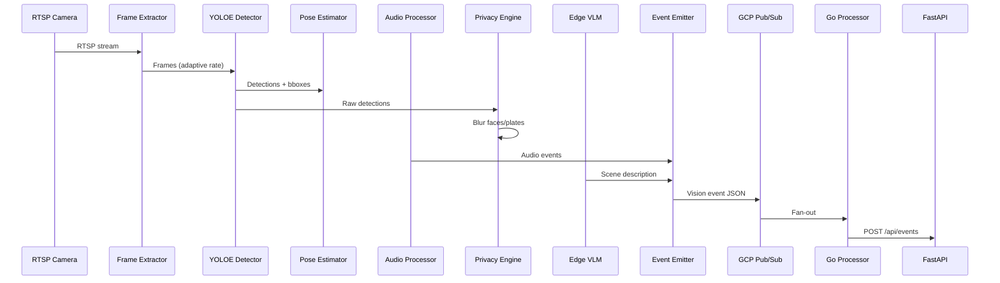
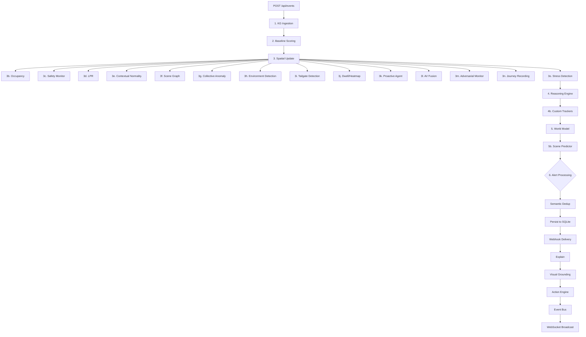
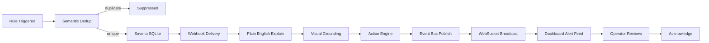
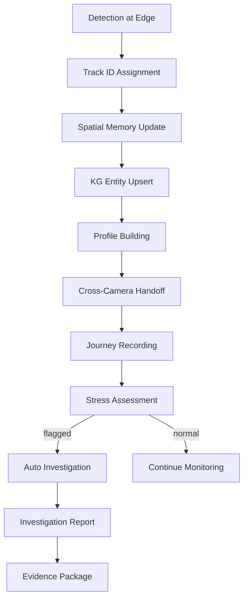

# Data Flow Architecture

Comprehensive documentation of how data moves through the VisionBrain system, from camera streams at the edge to alerts on the dashboard.

---

## Edge-to-Cloud Data Flow

Raw video streams are processed at the edge, converted into structured vision events, and published to the cloud for higher-order reasoning.



### Stage Descriptions

| Stage | Component | Input | Output | Notes |
|-------|-----------|-------|--------|-------|
| 1 | Frame Extractor | RTSP stream | Raw frames | Adaptive frame rate based on scene activity |
| 2 | YOLOE Detector | Frames | Bounding boxes + class labels | Runs on edge GPU |
| 3 | Pose Estimator | Detections | Keypoints per person | Used for stress/behavior analysis |
| 4 | Audio Processor | Microphone stream | Audio event classifications | Glass break, shouting, gunshot, etc. |
| 5 | Privacy Engine | Raw detections | Blurred frames | Faces and license plates blurred before any storage |
| 6 | Edge VLM | Keyframe + detections | Natural language scene description | Optional — requires Gemini API key |
| 7 | Event Emitter | All edge outputs | Vision event JSON | Publishes to GCP Pub/Sub or logs locally |
| 8 | Go Processor | Pub/Sub messages | HTTP POST | Fan-out and delivery guarantee |
| 9 | FastAPI | POST /api/events | Processing result | Cloud-side entry point |

---

## Event Processing Pipeline

Once an event arrives at the cloud API, it passes through a deep processing pipeline of service modules.



### Pipeline Stage Details

**Stage 1 — KG Ingestion:** Entities and relationships from the event are upserted into the knowledge graph (Neo4j if available, otherwise no-op with warning).

**Stage 2 — Baseline Scoring:** The event's anomaly score is computed against learned baselines for the camera and time-of-day.

**Stage 3 — Spatial Update + Sub-modules:** The spatial memory is updated with entity positions. This fans out to all spatial sub-modules:
- **3b Occupancy** — Zone-level person/vehicle counts
- **3c Safety Monitor** — PPE compliance, restricted area violations
- **3d LPR** — License plate recognition and watchlist matching
- **3e Contextual Normality** — Is this activity normal for this zone/time?
- **3f Scene Graph** — Entity relationship graph update
- **3g Collective Anomaly** — Group behavior analysis
- **3h Environment Detection** — Weather, lighting, smoke/fire
- **3i Tailgate Detection** — Unauthorized entry following authorized person
- **3j Dwell/Heatmap** — Loitering detection and spatial heatmaps
- **3k Proactive Agent** — Predictive alerts based on trajectory
- **3l AV Fusion** — Audio-visual correlation
- **3m Adversarial Monitor** — Detect camera tampering/obstruction
- **3n Journey Recording** — Cross-camera entity tracking
- **3o Stress Detection** — Behavioral stress indicators via pose

**Stage 4 — Reasoning Engine:** Aggregates all module outputs and applies rule-based + LLM reasoning. Custom trackers evaluate user-defined rules.

**Stage 5 — World Model:** Maintains a coherent world state. Scene predictor forecasts near-future states.

**Stage 6 — Alert Processing:** Triggered rules flow through deduplication, persistence, webhook delivery, explanation generation, visual grounding, action engine, and finally broadcast via WebSocket.

---

## Alert Lifecycle

How an alert moves from rule trigger to operator acknowledgment.



### Alert Deduplication

Semantic deduplication prevents alert fatigue:
- Alerts are compared against recent alerts (configurable window)
- Similarity is computed on (camera_id, rule_type, entity_ids, zone)
- Duplicate alerts are suppressed and the original's count is incremented
- Unique alerts proceed through the full lifecycle

### Explanation & Visual Grounding

Every alert includes:
- **Plain English explanation** — Generated by the reasoning engine describing what happened and why it matters
- **Visual grounding** — Bounding boxes and highlights on the keyframe showing exactly what triggered the alert
- **Confidence score** — How certain the system is about the alert
- **Contributing factors** — Which modules contributed to the alert decision

---

## Entity Lifecycle

How detected objects become tracked entities with rich profiles.



### Entity States

| State | Description |
|-------|-------------|
| **Detected** | First seen by a camera, track ID assigned |
| **Tracked** | Actively being followed in spatial memory |
| **Profiled** | Enough observations to build behavioral profile |
| **Handed Off** | Transferred between cameras via re-identification |
| **Flagged** | Stress or anomaly indicators exceed threshold |
| **Investigating** | Auto-investigation triggered, evidence being gathered |
| **Resolved** | Investigation complete, report generated |

### Cross-Camera Handoff

When an entity disappears from one camera and appears in another:
1. Re-identification compares appearance embeddings (Qdrant if available)
2. Spatial proximity and timing are used as secondary signals
3. If match confidence exceeds threshold, track IDs are merged
4. Journey record is updated with the camera transition

---

## Data Storage

| Store | Data Types | Retention | Notes |
|-------|-----------|-----------|-------|
| **SQLite** | alerts, cameras, webhooks, api_keys, report_schedules, investigations | Configurable per retention policy | Auto-created, zero deps |
| **Neo4j** | entities, events, relationships, temporal edges, entity profiles | Configurable | Optional, stub fallback |
| **Qdrant** | entity embeddings, scene embeddings for RAG | Until deleted | Optional, stub fallback |
| **In-memory** | spatial entities/zones, baselines, deques, occupancy history, heatmap grids, stress history, journey tracks, scene graph edges | Session lifetime | Lost on restart |

### Storage Fallback Behavior

The system is designed to degrade gracefully:

- **SQLite** is the only hard requirement — auto-created at startup
- **Neo4j unavailable** — KG operations log warnings and return empty results; the pipeline continues without graph queries
- **Qdrant unavailable** — RAG falls back to keyword search over SQLite; re-identification uses spatial heuristics only
- **In-memory data** — Rebuilt from incoming events after restart; no persistent state required

### Data Flow Between Stores

```
Event arrives → SQLite (alert persistence)
             → Neo4j (entity/relationship graph)
             → Qdrant (embedding index)
             → In-memory (real-time spatial state)
```

All writes are best-effort to optional stores. SQLite writes are the only ones that block the response.
